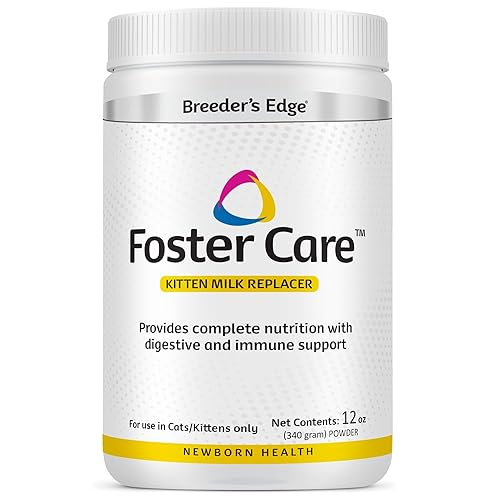
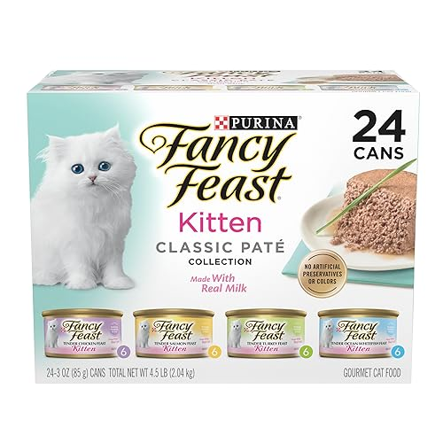
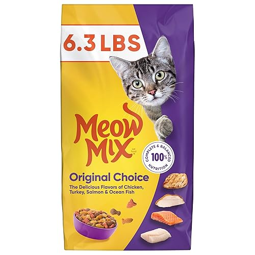

Cleveland Community Cat Project is a 501(c)(3) nonprofit organization (EIN: 88-3868710). Donations directly support veterinary care, spay/neuter surgeries, emergency rescue, foster supplies, food support, and medical treatment for community cats and kittens throughout Northeast Ohio. Contributions are tax deductible to the extent permitted by law.

Many employers offer matching gift programs that can double or triple charitable contributions made by employees. Check with your employer or human resources department to see whether your company participates in gift matching.

[Donate via PayPal/credit card](https://www.paypal.com/donate/?hosted_button_id=W4AA9YW6GAY6E){.main-button}

[\@ClevelandCatProjecton Venmo](https://account.venmo.com/u/clevelandcatproject){.main-button}

# Wishlist

## Help Supply Our Foster Cats

Community cats and foster kittens constantly need food, litter, formula, heating pads, medications, carriers, and cleaning supplies. Our Amazon Wishlist allows supporters to send urgently needed items directly to the rescue.

[Shop Our Wishlist](https://www.amazon.com/registries/gl/guest-view/AH10NQEXY3FR){.wishlist-button}

:::::: grid
::: g-col-4
{width="150"}

### Kitten Formula

Used for neonatal and orphaned kittens.
:::

::: g-col-4
{width="150"} \### Kitten Food

Essential for kittens.
:::

::: g-col-4
{width="150"}

### Dry Food

Feeds community cats and cats in foster care.
:::
::::::
