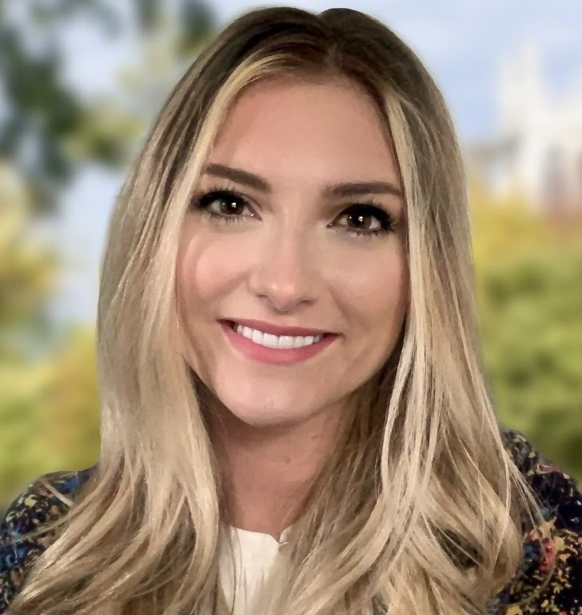
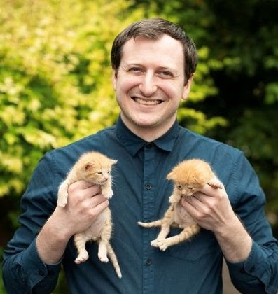
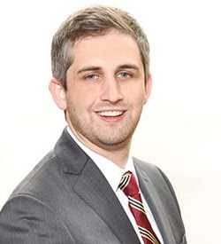

---

::: {.leadership-grid}

::: {.leadership-photo}

:::

::: {.leadership-text}

## Megan Zelinsky

Executive Director

Megan Zelinsky is a researcher, bioethicist, educator, and life-long animal advocate. She obtained her bachelor's degree in Biological Sciences from University of Pittsburgh, her master's degree in Bioethics and Medical Humanities from Case Western Reserve University School of Medicine, and is in the process of earning her PhD in Clinical and Translational Science from her alma mater.

Megan lives in Cleveland Heights with her permanent resident cats Penelope, Nimmy, and Rhory, and a revolving door of foster kittens. Beyond her dedication to feline friends, she is an avid reader and yoga-goer. Megan is dedicated to our mission of enhancing the well-being of community cats through our volunteer-led organization. Her approach centers on fostering collaborative partnerships with our community and implementing evidence-based methods for effective community cat management.

:::

:::

---

::: {.leadership-grid}

::: {.leadership-photo}

:::

::: {.leadership-text}

## Benjamin Zucker

Medical Director

Dr. Benjamin Zucker is a general practice and emergency veterinarian with a deep commitment to animal welfare and a passion for helping community cats. He obtained his Bachelor of Science in Biology from The Ohio State University and went on to complete his Doctor of Veterinary Medicine at The Ohio State University College of Veterinary Medicine.

Following his graduation in 2016, Ben pursued specialized training through internships in both emergency medicine and radiology, which have strengthened his expertise in handling complex and urgent cases.

Outside of his professional life, Ben is an avid Marvel movie fan, fitness enthusiast, and proud cat dad to Vergil and Gabriel. Known for his dedication and compassionate approach, he brings invaluable skills to our mission at Cleveland Community Cat Project, enhancing the health and welfare of community cats through evidence-based practices and expert medical care.

:::

:::

---

::: {.leadership-grid}

::: {.leadership-photo}

:::

::: {.leadership-text}

## AJ Kallay

Financial Director

AJ Kallay is a Senior Associate at Siegfried's Cleveland Market. He earned his Bachelor of Arts in accounting from the University of Mount Union and his Master of Business Administration from Cleveland State University.

AJ shares his home with two cats, Winona and Taz. Outside of Excel spreadsheets and vacuuming litter, AJ enjoys running, CrossFit, paddleboarding, hunting down great pizza, and staying active in the Cleveland community.

:::

:::